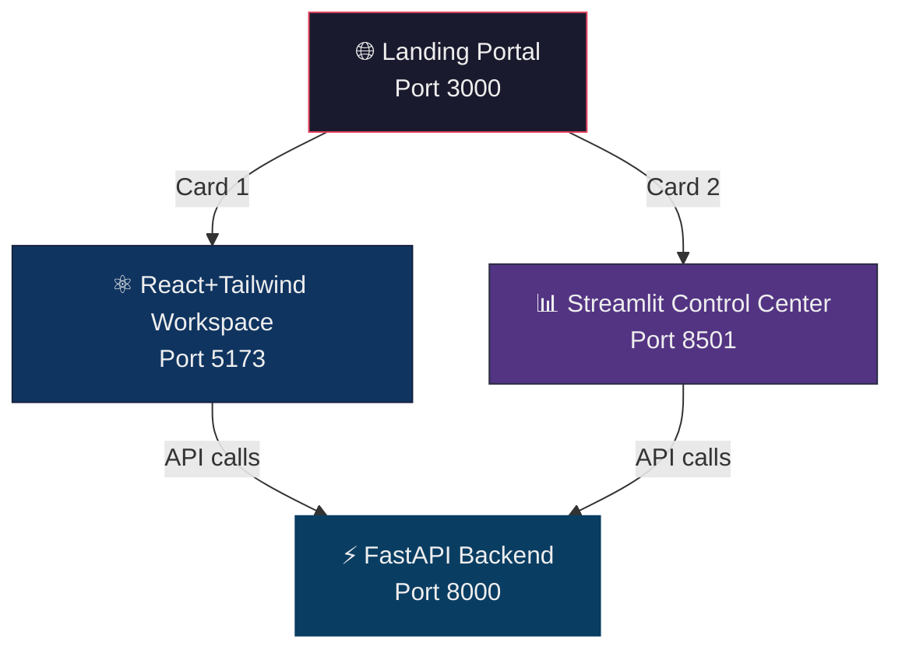
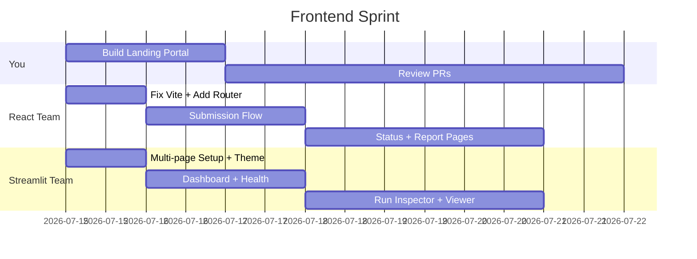

# Unified InsightSwarm Frontend Plan

## What We're Building

A static landing page at `frontend/landing/` that acts as the entry point to the entire InsightSwarm ecosystem — two claymorphism-styled cards linking out to the React workspace and the Streamlit dashboard.



Three separate apps, three separate ports during development. The landing page simply opens the other two in new tabs.

---

## Proposed Changes

### 1. Landing Portal — `frontend/landing/` (You build this)

A zero-dependency static site with claymorphism design. Separate folders per your preference:

```
frontend/landing/
├── index.html          ← Semantic HTML, SEO meta, Google Fonts (Inter + Space Grotesk)
├── css/
│   └── styles.css      ← Full claymorphism design system
├── js/
│   └── script.js       ← Tilt effect, scroll reveals, URL config
└── package.json        ← Vite only, dev server on :3000
```

**Design direction — Claymorphism on dark:**
- Deep navy base (`#0d0d1a` → `#13132b`)
- Cards with multi-layered shadows: outer depth + inner highlights for the soft 3D clay feel
- Floating gradient blobs in background, subtle noise texture
- Two large cards with SVG icons, status badges ("Production" / "Developer"), and animated CTA buttons
- Hover: 3D mouse-tracking tilt + shadow intensification
- Entrance: staggered fade-up on load
- Responsive: 2-column grid → stacked on mobile
- Minimal comments, natural coding style

**Card 1** — "Launch InsightSwarm Workspace" → opens `localhost:5173`
**Card 2** — "Open Developer Control Center" → opens `localhost:8501`

---

### 2. React+Tailwind Sub-Team Spec (2 members)

The React app at `frontend/React+Tailwind/` is the **InsightSwarm Workspace** — the user-facing research client.

> [!IMPORTANT]
> The Vite config is currently missing `@vitejs/plugin-react`. The team needs to add it or JSX won't compile properly.

**Features to build:**

| Feature | API Endpoint | Priority |
|---|---|---|
| Research Submission Form | `POST /api/research` | P0 |
| Live Status Polling | `GET /api/research/{run_id}` | P0 |
| Report Viewer (markdown) | `GET /api/research/{run_id}/report` | P1 |
| PDF Download Button | `GET /api/research/{run_id}/download` | P1 |
| Research History List | `GET /api/research/{run_id}` (multiple) | P2 |

**Packages to add:** `react-router-dom`, `axios`, `react-markdown`, `remark-gfm`, `framer-motion`

**Recommended folder structure:**
```
src/
├── components/       ← Button, Card, StatusBadge, Navbar
├── pages/            ← SubmitPage, StatusPage, ReportPage
├── services/         ← researchApi.js (axios instance, base URL config)
├── hooks/            ← useResearchStatus, useReport (polling logic)
├── App.jsx           ← Router + layout
├── main.jsx          ← Entry
└── index.css         ← Tailwind imports + custom tokens
```

CORS is already configured in [main.py](file:///e:/InsightSwarm/app/main.py) for `localhost:5173`.

---

### 3. Streamlit Sub-Team Spec (2 members)

The Streamlit app at `frontend/streamlit/` is the **Developer Control Center** — a diagnostic dashboard.

**Features to build:**

| Feature | API Endpoint | Priority |
|---|---|---|
| System Health Panel | `GET /health` | P0 |
| Research Run Monitor | `GET /api/research/{run_id}` | P0 |
| Run Inspector (drill-in) | `GET /api/research/{run_id}/report` | P1 |
| Report Preview (markdown) | `GET /api/research/{run_id}/report` | P1 |
| Log Viewer | Local file reads or future endpoint | P2 |

**Recommended file structure:**
```
streamlit/
├── streamlit-app.py          ← Main entry with page nav
├── pages/
│   ├── 1_🏠_Dashboard.py
│   ├── 2_🔍_Run_Inspector.py
│   └── 3_📄_Report_Viewer.py
├── components/
│   └── api_client.py          ← requests wrapper for FastAPI
└── .streamlit/
    └── config.toml            ← Dark theme matching landing page palette
```

**Theme config** (`.streamlit/config.toml`):
```toml
[theme]
primaryColor = "#e94560"
backgroundColor = "#0F2027"
secondaryBackgroundColor = "#203A43"
textColor = "#EAEAEA"
font = "sans serif"
```

> [!NOTE]
> The Streamlit team will need CORS added for `localhost:8501` in [main.py](file:///e:/InsightSwarm/app/main.py) if they call the FastAPI backend directly. Currently only `:5173` is whitelisted.

---

## Git Branch Strategy

| Branch | Owner | Purpose |
|---|---|---|
| `frontend/landing-portal` | You | Landing page |
| `frontend/react-workspace` | React sub-team | Full React client |
| `frontend/streamlit-dashboard` | Streamlit sub-team | Streamlit control center |

All merge to `main` via PR per your existing [README](file:///e:/InsightSwarm/README.md) workflow.

---

## Sprint Timeline



---

## Open Questions

> [!IMPORTANT]
> **Should I build the landing portal now?** I can create it immediately with claymorphism, separate folders, and minimal comments — ready for you to review.
